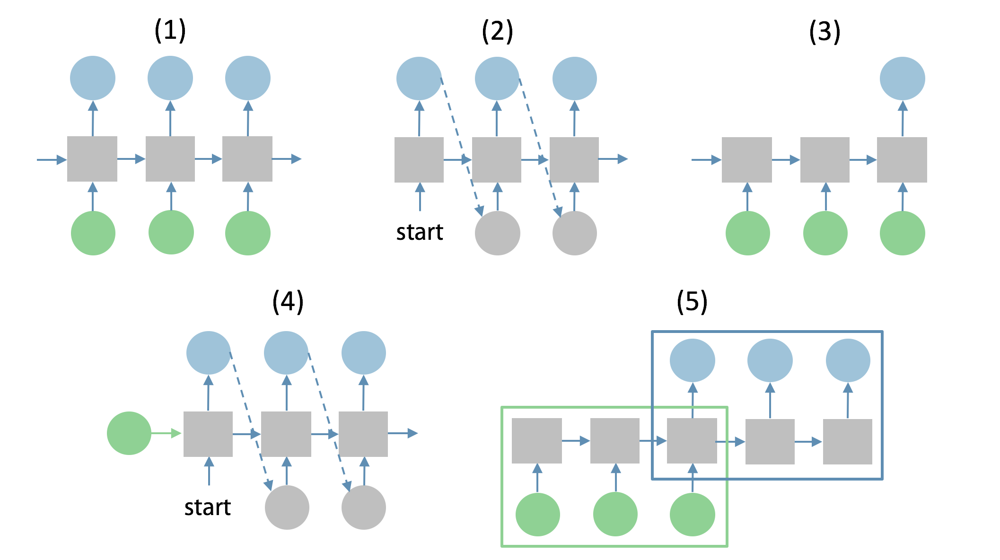
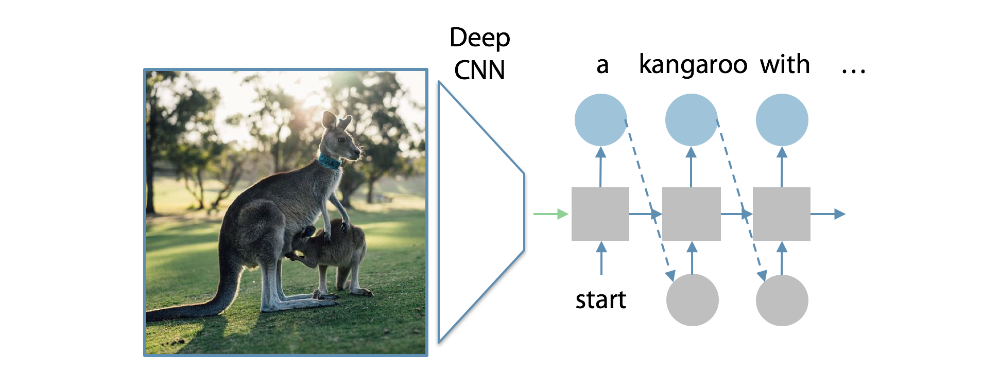

#### 1. Consider RNNs for five different types of tasks:
- 1. Element-wise sequence classification
- 2. Unconditional sequence generation
- 3. Sequence classification
- 4. Conditional sequence generation
- 5. Sequence translation

#### Which of these RNNs is the most suitable one to solve the task of music generation from scratch?
##### Ans: 2. Unconditional sequence generation
#### 2. Consider 5 different RNNs from the previous question. Which of these RNNs is the most suitable one to solve the task of music generation from notes?
##### Ans: 5. Sequence translation
#### 3. Consider 5 different RNNs from the first question. We want to generate music from scratch and additionally, each generated sample should be from a specific instrument. Which of these RNNs is the most suitable one to solve this task?
##### Ans: 4. Conditional sequence generation
#### 4. Choose correct statements about image captioning architecture from the lecture:

##### Ans: 
- It is possible to train this model end-to-end without pretraining.
- Any CNN may be used to represent an image with a feature vector.
#### 5. Suppose Nick has a trained sequence-to-sequence machine translation model. He wants to generate the translation for a new sentence in the way that this translation has the highest probability in the model. To do this at each time step of the decoder he chooses the most probable next word instead of the generating from the distribution. Does this scheme guaranty that the resulting output sentence is the most probable one?
##### Ans: No